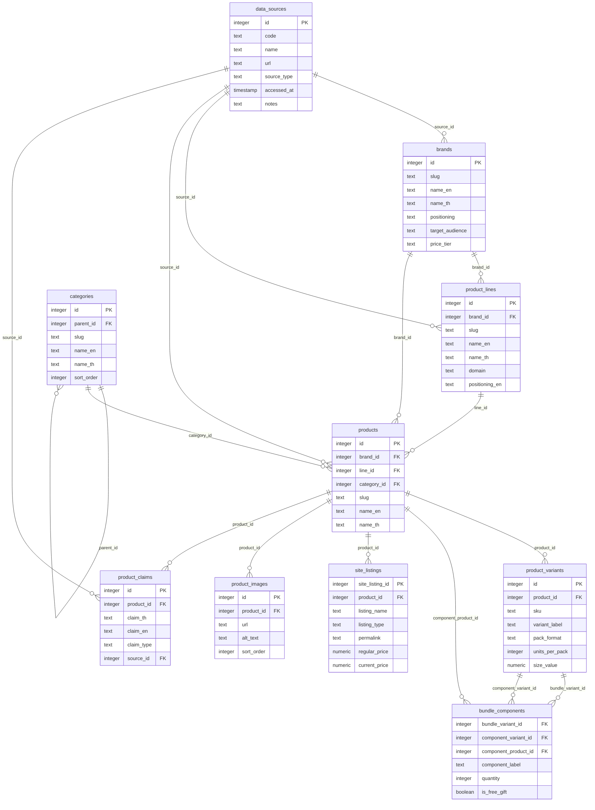
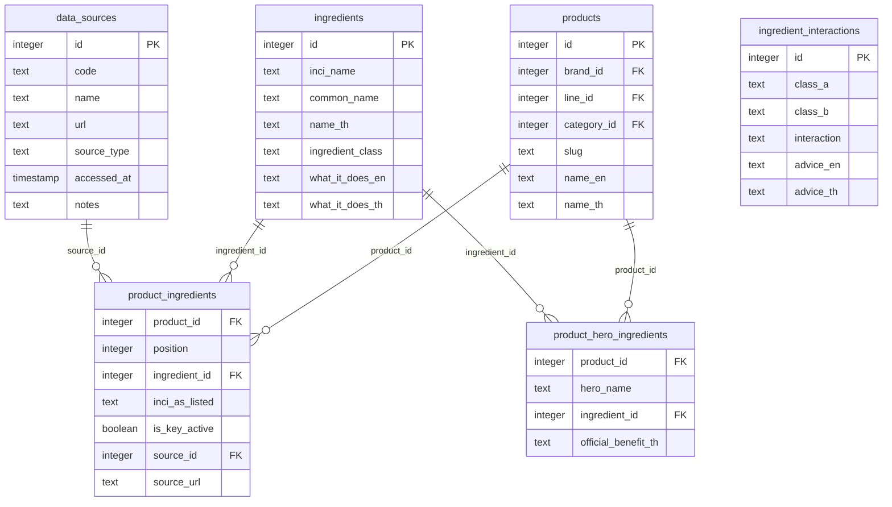
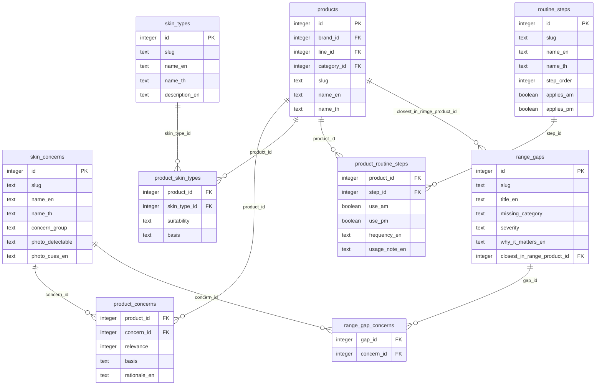
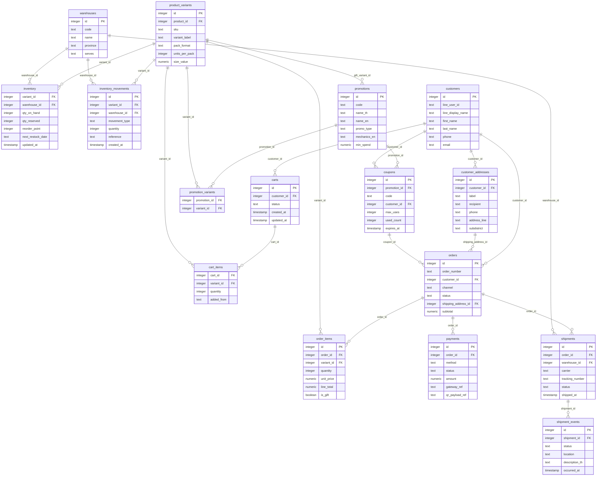
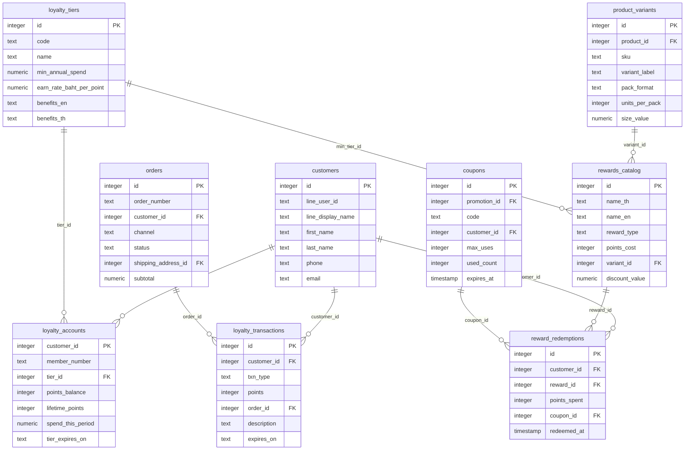
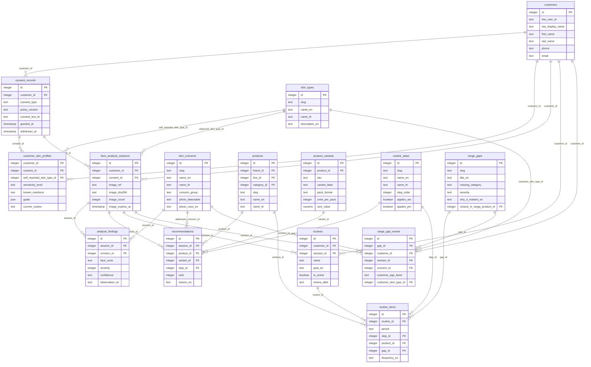

# Entity-relationship diagram

Generated from `db/schema.sql`. Rendered by GitHub, VS Code (Mermaid preview) or https://mermaid.live.

## 1. Catalogue (real, sourced)

## 2. Ingredients

## 3. Advisor knowledge (curated)

## 4. Commerce (mock)

## 5. Loyalty — Srichand Rewards

## 6. Advisor sessions (mock, PDPA-aware)

